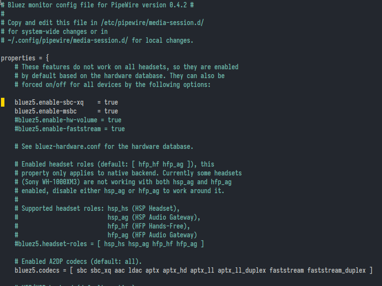

From archlinux wiki:
```
agent KeyboardOnly
default-agent
power on
scan on
# above command reveals devices
pair *device*
```

Connecting to device later on.

```
agent KeyboardOnly
default-agent
power on
devices # shows the devices and their address
connect *address*
```

Sometimes, when you switch on the bluetooth device you get prompt at blutoothctl shell
whether you want to connect or not. In this case you don't need `connect *address*`


```
vector@resonyze ~ % bluetoothctl
Waiting to connect to bluetoothd.
[bluetooth]# Agent registered
[bluetooth]# [CHG] Controller CO:3C:59:
[CHG] Device 4 g
Authorize service
yes
[WieCool N1]# Authorize service
[WeCool N11#  1;39m[agent] Authorize service B088111f-8006-1008-8008-00885¢9b34Fb (yes/no): [NEW] Endpoint /org/bluez/hci/dev_41.42_A2_76_C8_F3/sepl
[agent] Authorize service B088111f-0006-1006-8006-0888579b34Fb (yes/no): [NEW] Endpoint /org/bluez/hcib/dev_41_42_A2_76_C8_F3/sep2
[agent] Authorize service B088111f-006-100-8006-0888579b34Fb (yes/no): [NEW] Transport /org/bluez/hci6/dev_41_42_A2.76_C8_F3/dB
[agent] Authorize service 809111-0880-1808-3086-8030579b34fb (yes/no): yes
[WieCool N1]# Authorize service
[WeCool N1]# 1;39m[agent] Authorize service B088118e-0006-1006-8006-088579b34Fb (yes/no): yes
[WeCool N1]# [CHG] Transport /org/bluez/hcib/dev_4142_A2_76_C8_F3/fd8 Volue: 8x007f (127)
[WeCool N1]#
[WeCool N1]#
bluetooth]# hcid new_settings: powered bondable ssp br/edr le secure-conn
:28 Pairable: yes
```

## Attempt at pairing amazon basics bluetooth neckband.
### Update
I realized I could press power button + volume down in the neckband and it
enters a pairing mode. When the pairing mode is active, the device turned
up in bluetoothctl prompt.

Yeah. RTFM moment for me. But I still havent' read the manual though. I can't
find it. Oh well.


### Old way
Date: 02/17/2024

It was a pain in the ass to connect this device with `bluetoothctl`. I did the
usual stuff in `bluetoothctl`:

```
power on
default-agent
scan on
```

From this point I kept staring at the prompt for notification of device
discovery. It comes, but then pairing fails for some reason. Then I do the
following:

```
sudo systemctl restart bluetooth
systemctl --user restart pipewire
```

And then `Ctrl-d` out of bluetoothctl. Repeat the afforementioned usual stuff.
Nothing.

Then by accident my phone which I connected to the charging cable nearby
connects to the device. I turn of its bluetooth. THEN the device address turns
up at the at `bluetootctl prompt`. Then I did:


```
pair *address*
```

It works. For some reason it worked now though before it didn't. Finalized with

```
connect *address*
trust *address*
```

I hope its gonna be smooth sailing from this point because the device is now
listed with `devices` command at `bluetoothctl` prompt.

related: [switch audio sink](../switch-audio-sink)

## Solution to failed attempt at reconnecting to a previously paired device

[https://askubuntu.com/questions/1423297/org-bluez-error-authenticationtimeout-org-bluez-error-failed-br-connection-unkn](https://askubuntu.com/questions/1423297/org-bluez-error-authenticationtimeout-org-bluez-error-failed-br-connection-unkn)


## Poor sound quality

### Update on sound quality

I followed the instructions at [https://wiki.archlinux.org/title/PipeWire#Low_audio_quality_on_Bluetooth](https://wiki.archlinux.org/title/PipeWire#Low_audio_quality_on_Bluetooth)
and did the following:

```
sudo cp -r /usr/share/pipewire/media-session.d /etc/pipewire/
```
Uncommented these in `/etc/pipewire/media-session.d/bluez-monitor.conf`:



Finally:

```
systemctl --user restart pipewire
```
### Old way (worked then)

Disconnected and reconnected.


