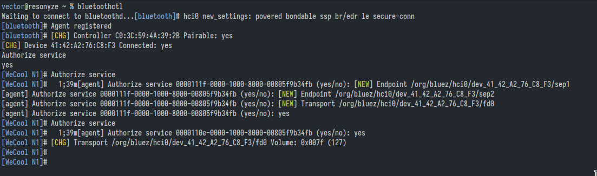
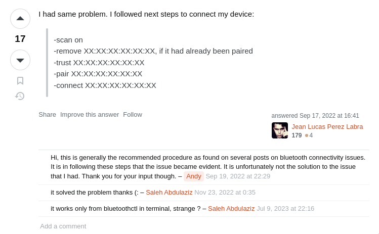
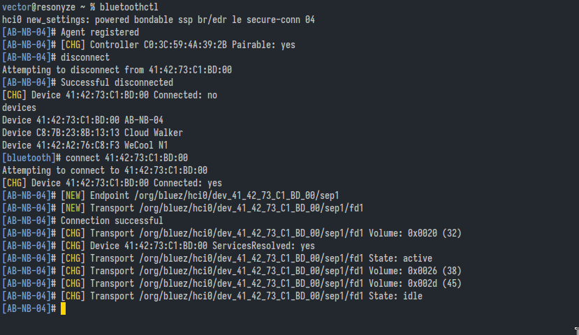
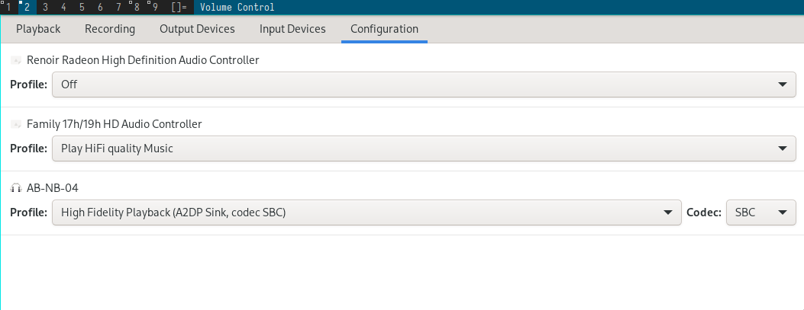

From archlinux wiki:
```
agent KeyboardOnly
default-agent
power on
scan on
# above command reveals devices
pair *device*
```

Connecting to device later on.

```
agent KeyboardOnly
default-agent
power on
devices # shows the devices and their address
connect *address*
```

Sometimes, when you switch on the bluetooth device you get prompt at blutoothctl shell
whether you want to connect or not. In this case you don't need `connect *address*`



```
vector@resonyze ~ % bluetoothctl
Waiting to connect to bluetoothd.
[bluetooth]# Agent registered
[bluetooth]# [CHG] Controller CO:3C:59:
[CHG] Device 4 g
Authorize service
yes
[WieCool N1]# Authorize service
[WeCool N11#  1;39m[agent] Authorize service B088111f-8006-1008-8008-00885¢9b34Fb (yes/no): [NEW] Endpoint /org/bluez/hci/dev_41.42_A2_76_C8_F3/sepl
[agent] Authorize service B088111f-0006-1006-8006-0888579b34Fb (yes/no): [NEW] Endpoint /org/bluez/hcib/dev_41_42_A2_76_C8_F3/sep2
[agent] Authorize service B088111f-006-100-8006-0888579b34Fb (yes/no): [NEW] Transport /org/bluez/hci6/dev_41_42_A2.76_C8_F3/dB
[agent] Authorize service 809111-0880-1808-3086-8030579b34fb (yes/no): yes
[WieCool N1]# Authorize service
[WeCool N1]# 1;39m[agent] Authorize service B088118e-0006-1006-8006-088579b34Fb (yes/no): yes
[WeCool N1]# [CHG] Transport /org/bluez/hcib/dev_4142_A2_76_C8_F3/fd8 Volue: 8x007f (127)
[WeCool N1]#
[WeCool N1]#
bluetooth]# hcid new_settings: powered bondable ssp br/edr le secure-conn
:28 Pairable: yes
```

## Attempt at pairing amazon basics bluetooth neckband.
### Update
I realized I could press power button + volume down in the neckband and it
enters a pairing mode. When the pairing mode is active, the device turned
up in bluetoothctl prompt.

Yeah. RTFM moment for me. But I still havent' read the manual though. I can't
find it. Oh well.


### Old way
Date: 02/17/2024

It was a pain in the ass to connect this device with `bluetoothctl`. I did the
usual stuff in `bluetoothctl`:

```
power on
default-agent
scan on
```

From this point I kept staring at the prompt for notification of device
discovery. It comes, but then pairing fails for some reason. Then I do the
following:

```
sudo systemctl restart bluetooth
systemctl --user restart pipewire
```

And then `Ctrl-d` out of bluetoothctl. Repeat the afforementioned usual stuff.
Nothing.

Then by accident my phone which I connected to the charging cable nearby
connects to the device. I turn of its bluetooth. THEN the device address turns
up at the at `bluetootctl prompt`. Then I did:


```
pair *address*
```

It works. For some reason it worked now though before it didn't. Finalized with

```
connect *address*
trust *address*
```

I hope its gonna be smooth sailing from this point because the device is now
listed with `devices` command at `bluetoothctl` prompt.

related: [switch audio sink](../switch-audio-sink)

## Solution to failed attempt at reconnecting to a previously paired device

[https://askubuntu.com/questions/1423297/org-bluez-error-authenticationtimeout-org-bluez-error-failed-br-connection-unkn](https://askubuntu.com/questions/1423297/org-bluez-error-authenticationtimeout-org-bluez-error-failed-br-connection-unkn)



## Poor sound quality

### Update on sound quality

I followed the instructions at [https://wiki.archlinux.org/title/PipeWire#Low_audio_quality_on_Bluetooth](https://wiki.archlinux.org/title/PipeWire#Low_audio_quality_on_Bluetooth)
and did the following:

```
sudo cp -r /usr/share/pipewire/media-session.d /etc/pipewire/
```
```
systemctl --user restart pipewire
```

`/usr/share/pipewire/media-session.d/bluez-monitor.conf`:

```
# Bluez monitor config file for PipeWire version 0.4.2 #
#
# Copy and edit this file in /etc/pipewire/media-session.d/
# for system-wide changes or in
# ~/.config/pipewire/media-session.d/ for local changes.

properties = {
    # These features do not work on all headsets, so they are enabled
    # by default based on the hardware database. They can also be
    # forced on/off for all devices by the following options:

    bluez5.enable-sbc-xq    = true
    bluez5.enable-msbc      = true
    #bluez5.enable-hw-volume = true
    #bluez5.enable-faststream = true

    # See bluez-hardware.conf for the hardware database.

    # Enabled headset roles (default: [ hfp_hf hfp_ag ]), this
    # property only applies to native backend. Currently some headsets
    # (Sony WH-1000XM3) are not working with both hsp_ag and hfp_ag
    # enabled, disable either hsp_ag or hfp_ag to work around it.
    #
    # Supported headset roles: hsp_hs (HSP Headset),
    #                          hsp_ag (HSP Audio Gateway),
    #                          hfp_hf (HFP Hands-Free),
    #                          hfp_ag (HFP Audio Gateway)
    #bluez5.headset-roles = [ hsp_hs hsp_ag hfp_hf hfp_ag ]

    # Enabled A2DP codecs (default: all).
    bluez5.codecs = [ sbc sbc_xq aac ldac aptx aptx_hd aptx_ll aptx_ll_duplex faststream faststream_duplex ]

    # HFP/HSP backend (default: native).
    # Available values: any, none, hsphfpd, ofono, native
    #bluez5.hfphsp-backend = native

    # HFP/HSP native backend modem (default: none).
    # Available values: none, any or the modem device string as found in
    #   'Device' property of org.freedesktop.ModemManager1.Modem interface
    #bluez5.hfphsp-backend-native-modem = none

    # Properties for the A2DP codec configuration
    #bluez5.default.rate     = 48000
    #bluez5.default.channels = 2

    # Register dummy AVRCP player, required for AVRCP volume function.
    # Disable if you are running mpris-proxy or equivalent.
    #bluez5.dummy-avrcp-player = true
}

rules = [
    # An array of matches/actions to evaluate.
    {
        # Rules for matching a device or node. It is an array of
        # properties that all need to match the regexp. If any of the
        # matches work, the actions are executed for the object.
        matches = [
            {
                # This matches all cards.
                device.name = "~bluez_card.*"
            }
        ]
        actions = {
            # Actions can update properties on the matched object.
            update-props = {

                # Auto-connect device profiles on start up or when only partial
                # profiles have connected. Disabled by default if the property
                # is not specified.
                #bluez5.auto-connect = [
                #    hfp_hf
                #    hsp_hs
                #    a2dp_sink
                #    hfp_ag
                #    hsp_ag
                #    a2dp_source
                #]
                bluez5.auto-connect = [ hfp_hf hsp_hs a2dp_sink ]
                # bluez5.auto-connect = [ a2dp_sink ]

                # Hardware volume control (default: all)
                #bluez5.hw-volume = [
                #    hfp_hf
                #    hsp_hs
                #    a2dp_sink
                #    hfp_ag
                #    hsp_ag
                #    a2dp_source
                #]

                # LDAC encoding quality
                # Available values: auto (Adaptive Bitrate, default)
                #                   hq   (High Quality, 990/909kbps)
                #                   sq   (Standard Quality, 660/606kbps)
                #                   mq   (Mobile use Quality, 330/303kbps)
                # bluez5.a2dp.ldac.quality = auto
                bluez5.a2dp.ldac.quality = hq

                # AAC variable bitrate mode
                # Available values: 0 (cbr, default), 1-5 (quality level)
                #bluez5.a2dp.aac.bitratemode = 0

                # Profile connected first
                # Available values: a2dp-sink (default), headset-head-unit
                bluez5.profile = a2dp-sink

                # A2DP <-> HFP profile auto-switching (when device is default output)
                # Available values: false, role (default), true
                # 'role' will switch the profile if the recording application
                # specifies Communication (or "phone" in PA) as the stream role.
                # bluez5.autoswitch-profile = role
                bluez5.autoswitch-profile = false
            }
        }
    }
    {
        matches = [
            {
                # Matches all sources.
                node.name = "~bluez_input.*"
            }
            {
                # Matches all sinks.
                node.name = "~bluez_output.*"
            }
        ]
        actions = {
            update-props = {
                #node.nick                       = "My Node"
                #node.nick                       = null
                #priority.driver                 = 100
                #priority.session                = 100
                node.pause-on-idle               = false
                #resample.quality                = 4
                #channelmix.normalize            = false
                #channelmix.mix-lfe              = false
                #session.suspend-timeout-seconds = 5            # 0 disables suspend
                #monitor.channel-volumes         = false

                # Media source role, "input" or "playback"
                # Defaults to "playback", playing stream to speakers
                # Set to "input" to use as an input for apps
                #bluez5.media-source-role = input
            }
        }
    }
]

```

### Try disconnecting and reconnecting.

Disconnected and reconnected.



## pavucontrol
This might be useful. Sound quality is good when profile is A2DP sink.



## Update 10/03/2024: Replaced piepwire-session-manager with wireplumber

I switched to wireplumber.

```shell
sudo pacman -R pipewire-session-manager
sudo pacman -S wireplumber
sudo mkdir -p /etc/wireplumber/bluetooth.lua.d
sudo cp /usr/share/wireplumber/bluetooth.lua.d/50-bluez-config.lua /etc/wireplumber/bluetooth.lua.d/
```
Since I had the problem of bluetooth earphones auto-connecting with low quality
HSP/HFP profile, I removed hsp hfp from autoconnect as recommended by archwiki:
[https://wiki.archlinux.org/title/bluetooth_headset#Disable_PipeWire_HSP/HFP_profile](https://wiki.archlinux.org/title/bluetooth_headset#Disable_PipeWire_HSP/HFP_profile)

Now `/etc/wireplumber/bluetooth.lua.d/50-bluez-config.lua` looks like:

```
bluez_monitor.enabled = true

bluez_monitor.properties = {
  -- Enabled roles (default: [ a2dp_sink a2dp_source bap_sink bap_source hfp_hf hfp_ag ])
  --
  -- Currently some headsets (Sony WH-1000XM3) are not working with
  -- both hsp_ag and hfp_ag enabled, so by default we enable only HFP.
  --
  -- Supported roles: hsp_hs (HSP Headset),
  --                  hsp_ag (HSP Audio Gateway),
  --                  hfp_hf (HFP Hands-Free),
  --                  hfp_ag (HFP Audio Gateway)
  --                  a2dp_sink (A2DP Audio Sink)
  --                  a2dp_source (A2DP Audio Source)
  --                  bap_sink (LE Audio Basic Audio Profile Sink)
  --                  bap_source (LE Audio Basic Audio Profile Source)
  --["bluez5.roles"] = "[ a2dp_sink a2dp_source bap_sink bap_source hsp_hs hsp_ag hfp_hf hfp_ag ]",

  -- Enabled A2DP codecs (default: all).
  --["bluez5.codecs"] = "[ sbc sbc_xq aac ldac aptx aptx_hd aptx_ll aptx_ll_duplex faststream faststream_duplex ]",

  -- HFP/HSP backend (default: native).
  -- Available values: any, none, hsphfpd, ofono, native
  --["bluez5.hfphsp-backend"] = "native",

  -- HFP/HSP native backend modem (default: none).
  -- Available values: none, any or the modem device string as found in
  --   'Device' property of org.freedesktop.ModemManager1.Modem interface
  --["bluez5.hfphsp-backend-native-modem"] = "none",

  -- HFP/HSP hardware offload SCO support (default: false).
  --["bluez5.hw-offload-sco"] = false,

  -- Properties for the A2DP codec configuration
  --["bluez5.default.rate"] = 48000,
  --["bluez5.default.channels"] = 2,

  -- Register dummy AVRCP player, required for AVRCP volume function.
  -- Disable if you are running mpris-proxy or equivalent.
  --["bluez5.dummy-avrcp-player"] = true,

  -- Opus Pro Audio mode settings
  --["bluez5.a2dp.opus.pro.channels"] = 3,  -- no. channels
  --["bluez5.a2dp.opus.pro.coupled-streams"] = 1,  -- no. joint stereo pairs, see RFC 7845 Sec. 5.1.1
  --["bluez5.a2dp.opus.pro.locations"] = "FL,FR,LFE",  -- audio locations
  --["bluez5.a2dp.opus.pro.max-bitrate"] = 600000,
  --["bluez5.a2dp.opus.pro.frame-dms"] = 50,  -- frame duration in 1/10 ms: 25, 50, 100, 200, 400
  --["bluez5.a2dp.opus.pro.bidi.channels"] = 1,  -- same settings for the return direction
  --["bluez5.a2dp.opus.pro.bidi.coupled-streams"] = 0,
  --["bluez5.a2dp.opus.pro.bidi.locations"] = "FC",
  --["bluez5.a2dp.opus.pro.bidi.max-bitrate"] = 160000,
  --["bluez5.a2dp.opus.pro.bidi.frame-dms"] = 400,

  -- Enable the logind module, which arbitrates which user will be allowed
  -- to have bluetooth audio enabled at any given time (particularly useful
  -- if you are using GDM as a display manager, as the gdm user also launches
  -- pipewire and wireplumber).
  -- This requires access to the D-Bus user session; disable if you are running
  -- a system-wide instance of wireplumber.
  ["with-logind"] = true,

  -- The settings below can be used to override feature enabled status. By default
  -- all of them are enabled. They may also be disabled via the hardware quirk
  -- database, see bluez-hardware.conf
  --["bluez5.enable-sbc-xq"] = true,
  --["bluez5.enable-msbc"] = true,
  --["bluez5.enable-hw-volume"] = true,
}

bluez_monitor.rules = {
  -- An array of matches/actions to evaluate.
  {
    -- Rules for matching a device or node. It is an array of
    -- properties that all need to match the regexp. If any of the
    -- matches work, the actions are executed for the object.
    matches = {
      {
        -- This matches all cards.
        { "device.name", "matches", "bluez_card.*" },
      },
    },
    -- Apply properties on the matched object.
    apply_properties = {
      -- Auto-connect device profiles on start up or when only partial
      -- profiles have connected. Disabled by default if the property
      -- is not specified.
      --["bluez5.auto-connect"] = "[ hfp_hf hsp_hs a2dp_sink hfp_ag hsp_ag a2dp_source ]",
      ["bluez5.auto-connect"] = "[ a2dp_sink ]",

      -- Hardware volume control (default: [ hfp_ag hsp_ag a2dp_source ])
      --["bluez5.hw-volume"] = "[ hfp_hf hsp_hs a2dp_sink hfp_ag hsp_ag a2dp_source ]",

      -- LDAC encoding quality
      -- Available values: auto (Adaptive Bitrate, default)
      --                   hq   (High Quality, 990/909kbps)
      --                   sq   (Standard Quality, 660/606kbps)
      --                   mq   (Mobile use Quality, 330/303kbps)
      --["bluez5.a2dp.ldac.quality"] = "auto",

      -- AAC variable bitrate mode
      -- Available values: 0 (cbr, default), 1-5 (quality level)
      --["bluez5.a2dp.aac.bitratemode"] = 0,

      -- Profile connected first
      -- Available values: a2dp-sink (default), headset-head-unit
      --["device.profile"] = "a2dp-sink",

      -- Opus Pro Audio encoding mode: audio, voip, lowdelay
      --["bluez5.a2dp.opus.pro.application"] = "audio",
      --["bluez5.a2dp.opus.pro.bidi.application"] = "audio",
    },
  },
  {
    matches = {
      {
        -- Matches all sources.
        { "node.name", "matches", "bluez_input.*" },
      },
      {
        -- Matches all sinks.
        { "node.name", "matches", "bluez_output.*" },
      },
    },
    apply_properties = {
      --["node.nick"] = "My Node",
      --["priority.driver"] = 100,
      --["priority.session"] = 100,
      --["node.pause-on-idle"] = false,
      --["resample.quality"] = 4,
      --["channelmix.normalize"] = false,
      --["channelmix.mix-lfe"] = false,
      --["session.suspend-timeout-seconds"] = 5,  -- 0 disables suspend
      --["monitor.channel-volumes"] = false,

      -- Media source role, "input" or "playback"
      -- Defaults to "playback", playing stream to speakers
      -- Set to "input" to use as an input for apps
      --["bluez5.media-source-role"] = "input",
    },
  },
}
```
