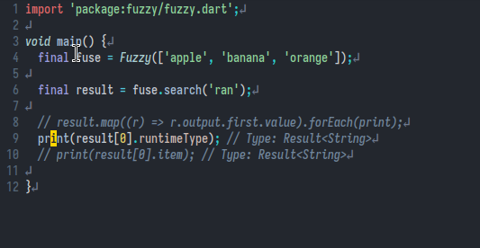

## Dart classes
The fields within a dart class are non-nullable unless its stated explicity with
a `?`. The following code is fine:

```dart
class SomeOne {
  String? name;
  int? age;
}
```

But the moment you delete the `?` marks, LSP will complain its a non-nullable
field and it must be initialized. This is important to keep in mind as we model
stuff as dart classes. 😀

But when we declare fields as `final`, its not the null-safety rules, but by
virtue of being final that we gotta intialize the fields.


Since final fields need to be initialized before the class gets instantiated,
they need to initialized BEFORE the constructor gets called. This is where
initializer lists comes in:


But we've gotta a shorthand for initializer list:


With the above definition of constructor, we're gonna have to initialize the
class with positional parameter: `var thisOne = SomeOne('Vector', 29)`. This
isn't as verbose as I would like it to be. This is where named arguments
and `{}` come into play:


But unlike positional paramaters, the parameters within `{}` are optional, so
nullable. This is the errors are raised. This is were `required` keyword
comes to play. When named parameters (those within `{}`) refer to fields that
are non-nullable, you need to preprend required before `this`.


## Installation
I followed the manual method of installation : [link](https://docs.flutter.dev/get-started/install/linux#method-2-manual-installation)

Note my path in `.zshrc.local` or `.bashrc`/`.zshrc` in your system:

```bash
export PATH="$PATH:$HOME/bin:$HOME/flutter/bin:$HOME/.pub-cache/bin:$HOME/.local/bin"
```

## Upgrade
To upgrade, I just `cd $HOME/flutter` and `flutter upgrade`

## Finding type of a value in dart

source: [https://howtoflutter.dev/how-to-check-type-of-a-variable-in-dart-or-flutter/](https://howtoflutter.dev/how-to-check-type-of-a-variable-in-dart-or-flutter/)

Used filed `runTimeType` of that value to determine its type.


