## Stateful Widget
[https://www.youtube.com/watch?v=AqCMFXEmf3w](https://www.youtube.com/watch?v=AqCMFXEmf3w)

To date (04/03/2024), this is the most insightful videos on flutter I've
watched. I'll summarize what I've understood with this and the last video on
Stateless widget.

Firstly, know that widgets that you create in flutter, by extending Stateless or
Stateful widgets, are immutable configuration files for *Elements*. It is these
*Elements* that we see on android/ios/linux/windows screen.

Forget flutter specifics for the moment. Imagine you want to display a screen
that contains message that says: "You pressed this screen $number times". It
contains 2 fields:

1. The message: "You pressed this $number time"
2. The number: number

You can model ths with a simple class

```dart
class Screen {
  int number = 0;
  String message = "You pressed this screen 0 times";

  void updateNumber() {
    number += 1;
    message = "You pressed this screen $number times";
  }

  void printOutPut() {
    print(message);
  }
}

void main() {
  var someScreen = Screen();
  someScreen.updateNumber();
  someScreen.updateNumber();
  someScreen.updateNumber();
  someScreen.printOutPut();
}
```

Its good to think in terms of classes this way. But how do we adapt our thinking
to work within the flutter framework? Firstly, all the `main()` function should
have the code `runApp()`.

When we incorprate runApp(), we had to make the following modifications:

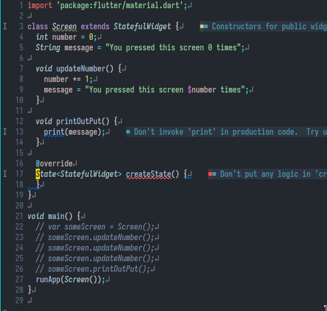

For `runApp()` to be legit code, you need to import material.dart. And `runApp`
expects a widget. So we make Screen extend Stateful widget. At this point
we note that Stateful widgets, once expanded into the widget tree by runApp
and then called by the flutter framework to create an Element creates a
StatefulElement. Stateful Element will refer back to the widget that created
and as for a State object. This is why classes that extend Stateful widgets
have a createState method.

Now let's make the required changes to have this display something on the
screen.

```dart
import 'package:flutter/material.dart';

class Screen extends StatefulWidget {
  String message = "You pressed this screen 0 times";

  @override
  State<StatefulWidget> createState() {
    return _ScreenState();
  }
}

class _ScreenState extends State<Screen> {
  int number = 0;
  @override
  Widget build(BuildContext context) {
    // TODO: implement build
    return Center(
      child: Text(
        "You pressed this screen $number times",
        style: TextStyle(
          fontSize: 24,
        ),
        textDirection: TextDirection.ltr,
      ),
    );
  }
}

void main() {
  // var someScreen = Screen();
  // someScreen.updateNumber();
  // someScreen.updateNumber();
  // someScreen.updateNumber();
  // someScreen.printOutPut();
  runApp(Screen());
}
```
Note that I choose to pack the field that changes with the State class. The
`StatefulElement` that gets loaded into the element tree from from root of the
widget tree, `Screen`, looks back to `Screen` for a `State` object. The element
tree hold the State object, which builds a widget to the widget tree, which
creates it corresponding element in the element tree which again refers back
to the widget for any children.

Remember how in the previous version of our app that just ran in the terminal
we put the code that updates the count field in the `main()`. But now the
context is different. We're inside a flutter app. We can have the flutter
framework itself execute the necessary code (which we pass as a function),

```dart
import 'package:flutter/material.dart';

class Screen extends StatefulWidget {
  String message = "You pressed this screen 0 times";

  @override
  State<StatefulWidget> createState() {
    return _ScreenState();
  }
}

class _ScreenState extends State<Screen> {
  int number = 0;
  @override
  Widget build(BuildContext context) {
    // TODO: implement build
    return GestureDetector(
      onTap: () {
        setState(() {
          number++;
        });
      },
      child: Center(
        child: Text(
          "You pressed this screen $number times",
          style: TextStyle(
            fontSize: 24,
          ),
          textDirection: TextDirection.ltr,
        ),
      ),
    );
  }
}

void main() {
  // var someScreen = Screen();
  // someScreen.updateNumber();
  // someScreen.updateNumber();
  // someScreen.updateNumber();
  // someScreen.printOutPut();
  runApp(Screen());
}
```

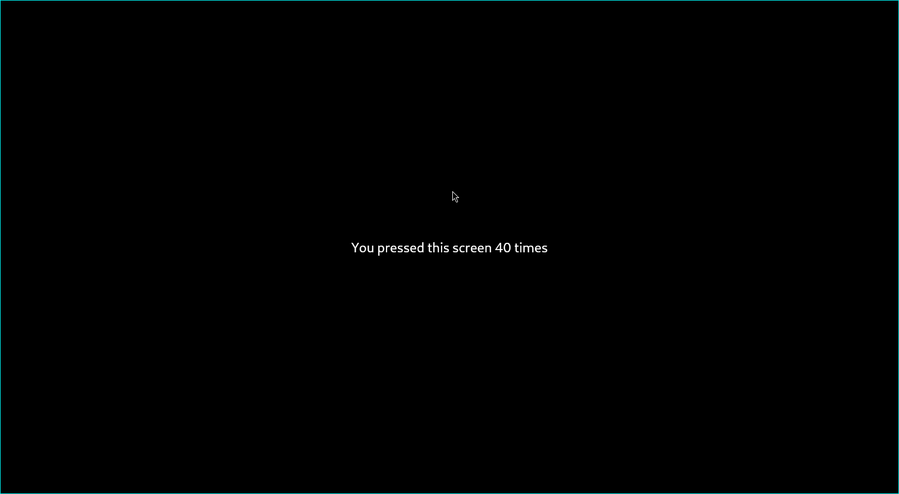

## Stateless Widgets
[https://www.youtube.com/watch?v=wE7khGHVkYY](https://www.youtube.com/watch?v=wE7khGHVkYY)

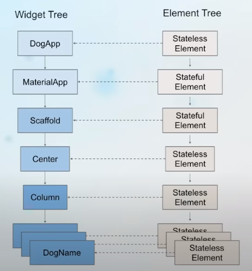

* Flutter apps have both an **Element tree** and a **Widget tree**.
* What we see on the screen is the Element tree. The Widget tree
  is the blueprint for the element tree.
* `runApp` takes the widget that's passed to it and makes it the root
  of the Widget tree.
* Once the widget is loaded to the root of the widget tree, Flutter
  framework calls the createElement method. This creates an instance
  of Element class that's gonna be the root of the element tree.
 
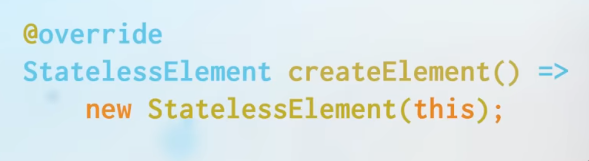

"A stateless widget is a widget that's composed of children. Which is
why it has a build method. 💡"

* The element tree then checks if it as any children, and calls the
  `build` method of the widget from which it was created.

Look at the widget-tree and the element-tree for the code below.

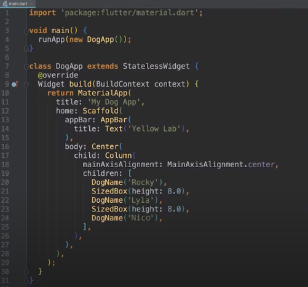

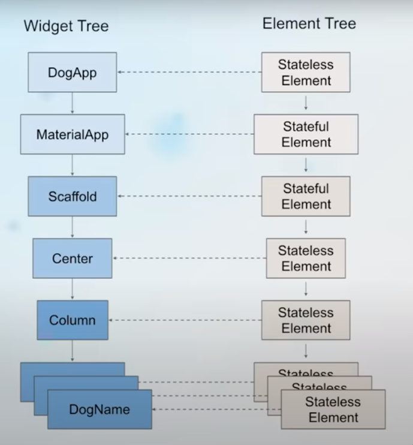

The widget at the root of the widget tree is the widget that you
defined, here `DogApp`.

## Dart classes
The fields within a dart class are non-nullable unless its stated explicity with
a `?`. The following code is fine:

```dart
class SomeOne {
  String? name;
  int? age;
}
```

But the moment you delete the `?` marks, LSP will complain its a non-nullable
field and it must be initialized. This is important to keep in mind as we model
stuff as dart classes. 😀

But when we declare fields as `final`, its not the null-safety rules, but by
virtue of being final that we gotta intialize the fields.

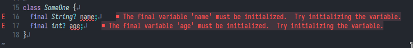

Since final fields need to be initialized before the class gets instantiated,
they need to initialized BEFORE the constructor gets called. This is where
initializer lists comes in:

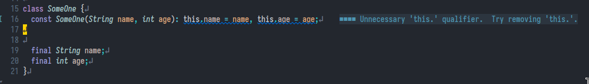

But we've gotta a shorthand for initializer list:

### Upate 2024-03-02 10:24AM
I no longer think this can be considered an equivalent to initializer list. The
below code just forces you to create an object of the class specifiying
arguments, whereas with initializer list you can check whether arguments are
null (not passed to the constructor) and set them approrpriate values.

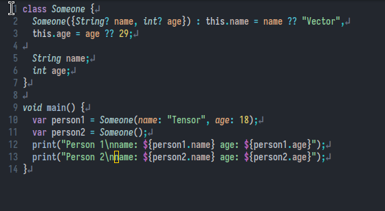

Yeah. So I no longer think below is a shorthand for initializer list:

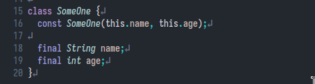

With the above definition of constructor, we're gonna have to initialize the
class with positional parameter: `var thisOne = SomeOne('Vector', 29)`. This
isn't as verbose as I would like it to be. This is where named arguments
and `{}` come into play:

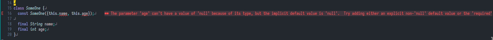

But unlike positional paramaters, the parameters within `{}` are optional, so
nullable. This is the errors are raised. This is were `required` keyword
comes to play. When named parameters (those within `{}`) refer to fields that
are non-nullable, you need to preprend required before `this`.

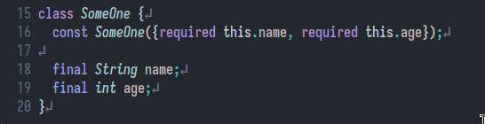

## Installation
I followed the manual method of installation : [link](https://docs.flutter.dev/get-started/install/linux#method-2-manual-installation)

Note my path in `.zshrc.local` or `.bashrc`/`.zshrc` in your system:

```bash
export PATH="$PATH:$HOME/bin:$HOME/flutter/bin:$HOME/.pub-cache/bin:$HOME/.local/bin"
```

## Upgrade
To upgrade, I just `cd $HOME/flutter` and `flutter upgrade`

* [meals app index](meals-app/index.md)
