## Streams
source: [https://www.youtube.com/watch?v=nQBpOIHE4eE](https://www.youtube.com/watch?v=nQBpOIHE4eE)

Streams:

* One of the fundamentals of reactive programming
* Future<Type> -> Asynchrously delivered value(of type Type) or error.

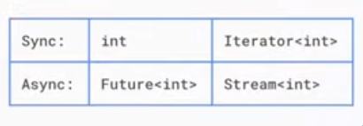

> If you think about the way a single value relates to an iterator of the same
> type, that's how a future relates to a stream.

> Just like with futures, the key is deciding in advance, here's what to do when
> a piece of data is ready, when there's an error, and when the stream
> completes.

## (Attempt) Reading a whole file from command line with dart.
source: [https://stackoverflow.com/a/28805065](https://stackoverflow.com/a/28805065)

There are shit tonne of youtube videos and other resources talking
about `stdin.readLineSync` to get input from the user. But what I
was looking for was how to read a file from stdin. Like so:

```sh
cat <<EOF | dart run testt.dart
This is line 1
This is line 2
This is line 3
EOF
```
But I found the afforementioned stackoverflow answer in source helpful.
Tried this, and I got the following error:

```dart
import 'dart:convert';
import 'dart:io';

void main() {
  stdin.echoMode = false;
  stdin.lineMode = false;
  var input = <int>[];
  var subscription;
  subscription = stdin.listen((List<int> data) {
    // if (data.contains(4)) {
    //   print(latin1.decode(data));
    //   subscription.cancel();
    // }
    if (!data.contains(4)) {
      input.add(data[0]);
    } else {
      print(latin1.decode(input));
      subscription.cancel();
    }
  });

  // stdin.echoMode = false;
  // stdin.lineMode = false;
  //
  // var subscription;
  // subscription = stdin.listen((List<int> data) {
  //   if (data.contains(4)) {
  //     print("EOF reached");
  //     subscription.cancel();
  //     print(latin1.decode(data));
  //   }
  //   // var s = latin1.decode(data);
  //   // stdout.write(s);
  //   // else {
  //   //   var s = latin1.decode(data);
  //   //   stdout.write(s);
  //   // }
  // });
}
```

Error:

```sh
255 vector@resonyze ~ % cat <<EOF | dart run testt.dart
This is line 1
This is line 2
This is line 3
EOF
Unhandled exception:
StdinException: Error setting terminal echo mode, OS Error: Inappropriate ioctl for device, errno = 25
#0      Stdin.echoMode= (dart:io-patch/stdio_patch.dart:85:7)
#1      main (file:///home/vector/testt.dart:7:9)
#2      _delayEntrypointInvocation.<anonymous closure> (dart:isolate-patch/isolate_patch.dart:297:19)
#3      _RawReceivePort._handleMessage (dart:isolate-patch/isolate_patch.dart:184:12)

```


## Container class
source: [https://api.flutter.dev/flutter/widgets/Container-class.html](https://api.flutter.dev/flutter/widgets/Container-class.html)

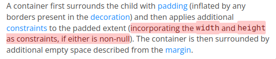

The `height`, and `width` properties of the `Container`, become constraints
to the child of `Container`.

Note that you don't specify a max height or min height, just height (same
for width). What this implies is that height argument of Container is both
max and min, which means the Container basically forces its child widget to
to the dimensions specified in `height` and `width` argument.

## Constraints
source: [https://docs.flutter.dev/ui/layout/constraints](https://docs.flutter.dev/ui/layout/constraints)

The widget (colored some shade of white) below is composed of a Column. The
Column contains 2 childs: FIRST CHILD and SECOND CHILD.

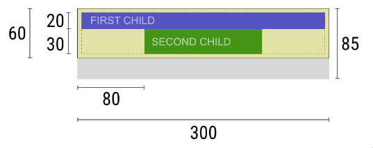

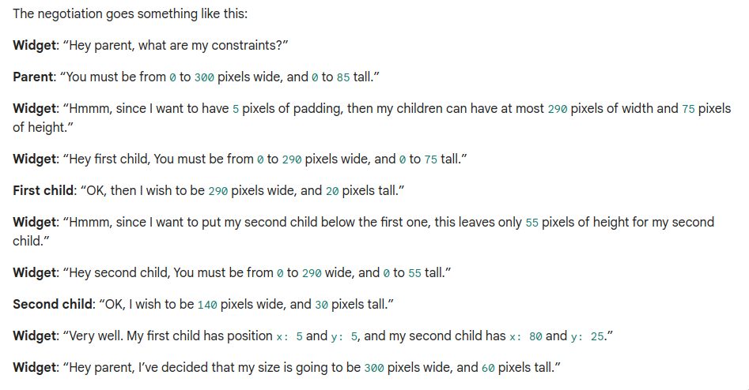

From the above 'negotiation' we see that the parent has given to this widget a
range of values for height and width from which it can choose (unlike a container
widget parent where a height and width are passed as arguments). But note that
before it reports it size, it passes constraints to its child widgets after
adjusting for padding field.

> Widget: “Hmmm, since | want to have  pixels of padding, then my children can
  have at most 290 pixels of width and 75 pixels of height.”

Now the child widget (FIRST CHILD) has to pick its dimensions from the range
provided by constraints. It picks the maximum width available to it: 290. For
height it picks 20. Remember the maximum height given to it was the size
available to the parent minus the padding applied (85 - 10 = 75). Now the parent
has 75 - 20 = 55 left to it. So the second child is left to pick from 0-55 for
height and 0-290 for width. Now the widget positions the child elements. Now
since the child widgets have decided their size, the widget reports to its own
parent that it will have a width of 300 (since one of its child wanted the max)
and a height of 60, which is the height of its child widgets + padding.

## Default app
Its worth taking a serious look into the default app created by
flutter when you run `flutter create someApp`:

```dart
import 'package:flutter/material.dart';

void main() {
  runApp(const MyApp());
}

class MyApp extends StatelessWidget {
  const MyApp({super.key});

  // This widget is the root of your application.
  @override
  Widget build(BuildContext context) {
    return MaterialApp(
      title: 'Flutter Demo',
      theme: ThemeData(
        // This is the theme of your application.
        //
        // TRY THIS: Try running your application with "flutter run". You'll see
        // the application has a purple toolbar. Then, without quitting the app,
        // try changing the seedColor in the colorScheme below to Colors.green
        // and then invoke "hot reload" (save your changes or press the "hot
        // reload" button in a Flutter-supported IDE, or press "r" if you used
        // the command line to start the app).
        //
        // Notice that the counter didn't reset back to zero; the application
        // state is not lost during the reload. To reset the state, use hot
        // restart instead.
        //
        // This works for code too, not just values: Most code changes can be
        // tested with just a hot reload.
        colorScheme: ColorScheme.fromSeed(seedColor: Colors.deepPurple),
        useMaterial3: true,
      ),
      home: const MyHomePage(title: 'Flutter Demo Home Page'),
    );
  }
}

class MyHomePage extends StatefulWidget {
  const MyHomePage({super.key, required this.title});

  // This widget is the home page of your application. It is stateful, meaning
  // that it has a State object (defined below) that contains fields that affect
  // how it looks.

  // This class is the configuration for the state. It holds the values (in this
  // case the title) provided by the parent (in this case the App widget) and
  // used by the build method of the State. Fields in a Widget subclass are
  // always marked "final".

  final String title;

  @override
  State<MyHomePage> createState() => _MyHomePageState();
}

class _MyHomePageState extends State<MyHomePage> {
  int _counter = 0;

  void _incrementCounter() {
    setState(() {
      // This call to setState tells the Flutter framework that something has
      // changed in this State, which causes it to rerun the build method below
      // so that the display can reflect the updated values. If we changed
      // _counter without calling setState(), then the build method would not be
      // called again, and so nothing would appear to happen.
      _counter++;
    });
  }

  @override
  Widget build(BuildContext context) {
    // This method is rerun every time setState is called, for instance as done
    // by the _incrementCounter method above.
    //
    // The Flutter framework has been optimized to make rerunning build methods
    // fast, so that you can just rebuild anything that needs updating rather
    // than having to individually change instances of widgets.
    return Scaffold(
      appBar: AppBar(
        // TRY THIS: Try changing the color here to a specific color (to
        // Colors.amber, perhaps?) and trigger a hot reload to see the AppBar
        // change color while the other colors stay the same.
        backgroundColor: Theme.of(context).colorScheme.inversePrimary,
        // Here we take the value from the MyHomePage object that was created by
        // the App.build method, and use it to set our appbar title.
        title: Text(widget.title),
      ),
      body: Center(
        // Center is a layout widget. It takes a single child and positions it
        // in the middle of the parent.
        child: Column(
          // Column is also a layout widget. It takes a list of children and
          // arranges them vertically. By default, it sizes itself to fit its
          // children horizontally, and tries to be as tall as its parent.
          //
          // Column has various properties to control how it sizes itself and
          // how it positions its children. Here we use mainAxisAlignment to
          // center the children vertically; the main axis here is the vertical
          // axis because Columns are vertical (the cross axis would be
          // horizontal).
          //
          // TRY THIS: Invoke "debug painting" (choose the "Toggle Debug Paint"
          // action in the IDE, or press "p" in the console), to see the
          // wireframe for each widget.
          mainAxisAlignment: MainAxisAlignment.center,
          children: <Widget>[
            const Text(
              'You have pushed the button this many times:',
            ),
            Text(
              '$_counter',
              style: Theme.of(context).textTheme.headlineMedium,
            ),
          ],
        ),
      ),
      floatingActionButton: FloatingActionButton(
        onPressed: _incrementCounter,
        tooltip: 'Increment',
        child: const Icon(Icons.add),
      ), // This trailing comma makes auto-formatting nicer for build methods.
    );
  }
}
```

* `runApp` can take any widget and it will make it the root of the widget tree.
  But if you're going to design an app with Material design use MaterialApp
  widget as the root of your app.
* Note the three arguments of `MaterialApp` here:
    * `title`
    * `home`
    * `theme`
* Note the three arguments of `Scaffold` here:
    * `appBar`
    * `body`
    * `floatingActionButton`

## Bulding UI with Flutter
source: [https://docs.flutter.dev/ui](https://docs.flutter.dev/ui)

* Central idea: Build UI out of widgets.
* Widgets describe what their view should look like given their current
  configuration and state. When a widget's state changes, the widget rebuilds
  its descripton, which the framework **diffs** against the previous description
  in order to determine the minimal changes needed in the underlying render
  tree to transition from one state to next.

💡 Widgets are descriptions/configurations/blueprints. Note the above point:
_when a widget's state changes, the widget rebuilds its description, which the
framework diffs against..._ If you know the diff command in Linux, it literally
works on text files. Remember that widgets are NOT what's displayed on the
screen, what gets displayed are elements. There's a distinct widget tree and
an element tree.

## Result of / is always a floating point type
```dart
4 / 2
2.0
```

To get a value of type int do:
```dart
4 ~/ 2
2
```

## Event loop vs main() function
test.dart:
```dart
void main() {
  Future.delayed(Duration(seconds: 5), () { print("But the program ends here."); });
  print("main function ends here.");
}
```

If we look at above code for `test.dart`, we might get the impression that
with the line `print("main function ends here.")` the little program comes
to an end. But, there's more to it than what meets the eye.

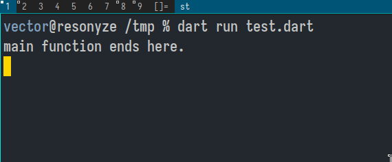

Even after running the last line of code of the `main` has executed, the program
keeps running. Why? Because there's something in the event queue. Only after
the event queue becomes empty, does the program come to an end:

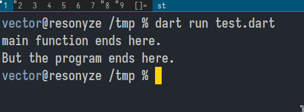

## async
You put `async` keyword on functions that will be working with
a `Future<T>` value. On the line that takes the `Future<T>` value
there's going to be the `await` keyword.

## Neat shorthand for functions
Dart has a neat shorthand for functions whose computation can be contained
in a single line of code. Example:

```dart
int someFunc() => 2;

void main() {
  print(someFunc());
}
```

## Visualizing Future<String>
`Future<String>` or any `Future<T>` is the result of an *asynchronous operation*.

[Quote](https://api.dart.dev/stable/3.3.0/dart-async/Future-class.html): 

  An asynchronous computation cannot provide a result immediately when it is
  started, unlike a synchronous computation which does compute a result
  immediately by either returning a value or by throwing. An asynchronous
  computation may need to wait for something external to the program (reading a
  file, querying a database, fetching a web page) which takes time. Instead of
  blocking all computation until the result is available, the asynchronous
  computation immediately returns a Future which will eventually "complete" with
  the result.

`Future.delayed(Duration(seconds: 5), () => "Result string")` is a good way
to visualize a `Future<String>`.

```dart
void main() async {
  var result = await someReturn();
  print("The result of computation is: ${result}");
}

Future<String> someReturn() {
  return Future.delayed(Duration(seconds: 5), () => "Result string");
}
```

## Synchronous and Asynchrnous
source: [https://dart.dev/codelabs/async-await](https://dart.dev/codelabs/async-await)

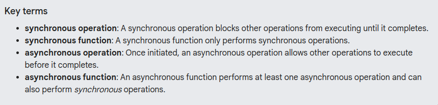

## Reading Documentation/LSP Info
```dart
(new) Future<String> Future.delayed(Duration duration, [FutureOr<String> Function()? computation])
```

When looking up dart documentation, you might come across code like above. It
gives you core info about the `Future.delayed` function :

1. The function is `Future.delayed`
2. It returns a `Future<String>` value
3. It *needs* (compulsory) a value of type `Duration` to be passed to it.
4. Opitionally, you can pass to it a function that returns a `FutureOr<String>`.

## Isolates and Event Loops
[https://www.youtube.com/watch?v=vl_AaCgudcY](https://www.youtube.com/watch?v=vl_AaCgudcY)

Today (05/03/2024), is my second day watching this video. I realize now this
diagram is an accurate and neat way to visualize an isolate:

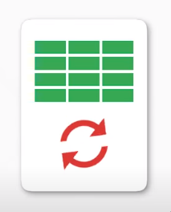

to

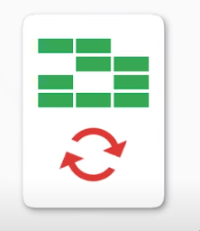

The animations of that diagram makes a lot of sense too. You see those green
blocks that light up or switch off, they're representing the memory that's
allocated to the isolate.

And the arrows that circle around one another is the event loop (obviously).
The event loop, that *runs* also has its own thread.

Crucial point is that ALL dart code run in an isolate.

"In dart, each thread is in its own isolate, with its own memory and it just
processes events."

### Update: 06/03/2024
[00:34](https://youtu.be/vl_AaCgudcY?t=30): "What makes asynchrony possible in dart? Isolates"
[02:17](https://youtu.be/vl_AaCgudcY?t=137): "What really makes async code
possible: the Event Loop"

"All of the high level APIs that we're used to for asynchronous programming:
Futures, Streams, async and await, they're all built on and around this simple
loop."

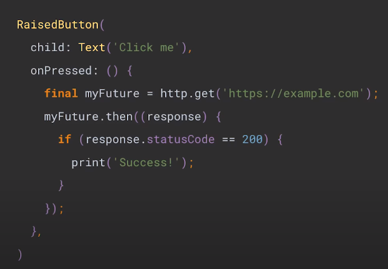

### Update: 07/03/2024

Isolate example used in the video:

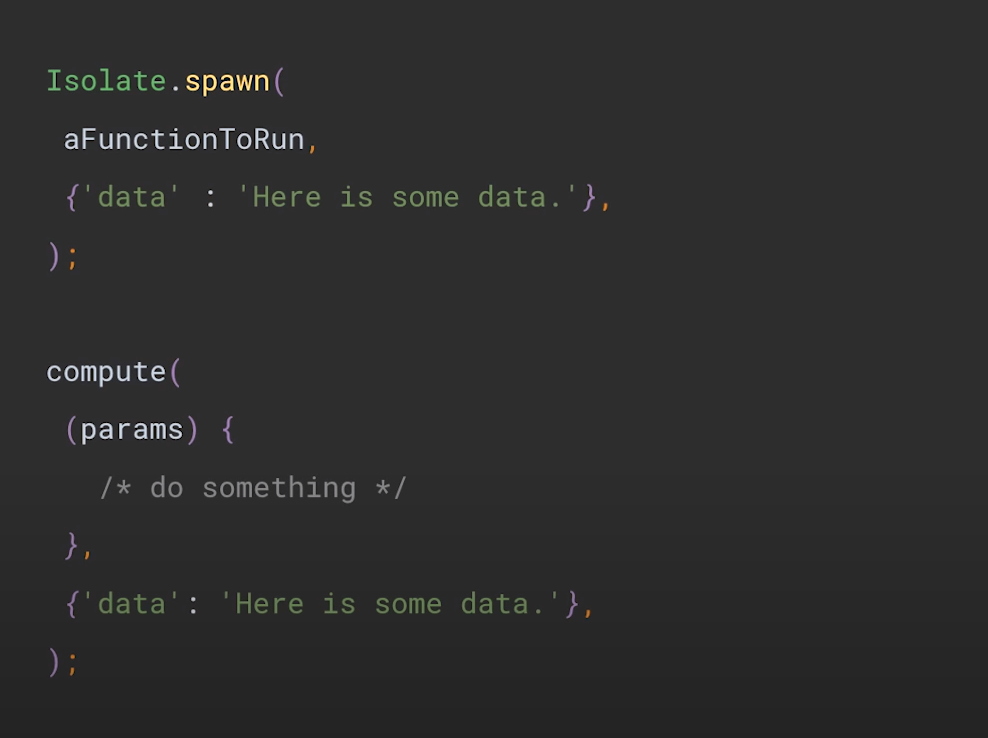

## Stateful Widget
[https://www.youtube.com/watch?v=AqCMFXEmf3w](https://www.youtube.com/watch?v=AqCMFXEmf3w)

To date (04/03/2024), this is the most insightful videos on flutter I've
watched. I'll summarize what I've understood with this and the last video on
Stateless widget.

Firstly, know that widgets that you create in flutter, by extending Stateless or
Stateful widgets, are immutable configuration files for *Elements*. It is these
*Elements* that we see on android/ios/linux/windows screen.

Forget flutter specifics for the moment. Imagine you want to display a screen
that contains message that says: "You pressed this screen $number times". It
contains 2 fields:

1. The message: "You pressed this $number time"
2. The number: number

You can model ths with a simple class

```dart
class Screen {
  int number = 0;
  String message = "You pressed this screen 0 times";

  void updateNumber() {
    number += 1;
    message = "You pressed this screen $number times";
  }

  void printOutPut() {
    print(message);
  }
}

void main() {
  var someScreen = Screen();
  someScreen.updateNumber();
  someScreen.updateNumber();
  someScreen.updateNumber();
  someScreen.printOutPut();
}
```

Its good to think in terms of classes this way. But how do we adapt our thinking
to work within the flutter framework? Firstly, all the `main()` function should
have the code `runApp()`.

When we incorprate runApp(), we had to make the following modifications:


For `runApp()` to be legit code, you need to import material.dart. And `runApp`
expects a widget. So we make Screen extend Stateful widget. At this point
we note that Stateful widgets, once expanded into the widget tree by runApp
and then called by the flutter framework to create an Element creates a
StatefulElement. Stateful Element will refer back to the widget that created
and as for a State object. This is why classes that extend Stateful widgets
have a createState method.

Now let's make the required changes to have this display something on the
screen.

```dart
import 'package:flutter/material.dart';

class Screen extends StatefulWidget {
  String message = "You pressed this screen 0 times";

  @override
  State<StatefulWidget> createState() {
    return _ScreenState();
  }
}

class _ScreenState extends State<Screen> {
  int number = 0;
  @override
  Widget build(BuildContext context) {
    // TODO: implement build
    return Center(
      child: Text(
        "You pressed this screen $number times",
        style: TextStyle(
          fontSize: 24,
        ),
        textDirection: TextDirection.ltr,
      ),
    );
  }
}

void main() {
  // var someScreen = Screen();
  // someScreen.updateNumber();
  // someScreen.updateNumber();
  // someScreen.updateNumber();
  // someScreen.printOutPut();
  runApp(Screen());
}
```
Note that I choose to pack the field that changes with the State class. The
`StatefulElement` that gets loaded into the element tree from from root of the
widget tree, `Screen`, looks back to `Screen` for a `State` object. The element
tree hold the State object, which builds a widget to the widget tree, which
creates it corresponding element in the element tree which again refers back
to the widget for any children.

Remember how in the previous version of our app that just ran in the terminal
we put the code that updates the count field in the `main()`. But now the
context is different. We're inside a flutter app. We can have the flutter
framework itself execute the necessary code (which we pass as a function),

```dart
import 'package:flutter/material.dart';

class Screen extends StatefulWidget {
  String message = "You pressed this screen 0 times";

  @override
  State<StatefulWidget> createState() {
    return _ScreenState();
  }
}

class _ScreenState extends State<Screen> {
  int number = 0;
  @override
  Widget build(BuildContext context) {
    // TODO: implement build
    return GestureDetector(
      onTap: () {
        setState(() {
          number++;
        });
      },
      child: Center(
        child: Text(
          "You pressed this screen $number times",
          style: TextStyle(
            fontSize: 24,
          ),
          textDirection: TextDirection.ltr,
        ),
      ),
    );
  }
}

void main() {
  // var someScreen = Screen();
  // someScreen.updateNumber();
  // someScreen.updateNumber();
  // someScreen.updateNumber();
  // someScreen.printOutPut();
  runApp(Screen());
}
```


## Stateless Widgets
[https://www.youtube.com/watch?v=wE7khGHVkYY](https://www.youtube.com/watch?v=wE7khGHVkYY)


* Flutter apps have both an **Element tree** and a **Widget tree**.
* What we see on the screen is the Element tree. The Widget tree
  is the blueprint for the element tree.
* `runApp` takes the widget that's passed to it and makes it the root
  of the Widget tree.
* Once the widget is loaded to the root of the widget tree, Flutter
  framework calls the createElement method. This creates an instance
  of Element class that's gonna be the root of the element tree.
 


"A stateless widget is a widget that's composed of children. Which is
why it has a build method. 💡"

* The element tree then checks if it as any children, and calls the
  `build` method of the widget from which it was created.

Look at the widget-tree and the element-tree for the code below.


The widget at the root of the widget tree is the widget that you
defined, here `DogApp`.

## Dart classes
The fields within a dart class are non-nullable unless its stated explicity with
a `?`. The following code is fine:

```dart
class SomeOne {
  String? name;
  int? age;
}
```

But the moment you delete the `?` marks, LSP will complain its a non-nullable
field and it must be initialized. This is important to keep in mind as we model
stuff as dart classes. 😀

But when we declare fields as `final`, its not the null-safety rules, but by
virtue of being final that we gotta intialize the fields.


Since final fields need to be initialized before the class gets instantiated,
they need to initialized BEFORE the constructor gets called. This is where
initializer lists comes in:


But we've gotta a shorthand for initializer list:

### Upate 2024-03-02 10:24AM
I no longer think this can be considered an equivalent to initializer list. The
below code just forces you to create an object of the class specifiying
arguments, whereas with initializer list you can check whether arguments are
null (not passed to the constructor) and set them approrpriate values.


Yeah. So I no longer think below is a shorthand for initializer list:


With the above definition of constructor, we're gonna have to initialize the
class with positional parameter: `var thisOne = SomeOne('Vector', 29)`. This
isn't as verbose as I would like it to be. This is where named arguments
and `{}` come into play:


But unlike positional paramaters, the parameters within `{}` are optional, so
nullable. This is the errors are raised. This is were `required` keyword
comes to play. When named parameters (those within `{}`) refer to fields that
are non-nullable, you need to preprend required before `this`.


## Installation
I followed the manual method of installation : [link](https://docs.flutter.dev/get-started/install/linux#method-2-manual-installation)

Note my path in `.zshrc.local` or `.bashrc`/`.zshrc` in your system:

```bash
export PATH="$PATH:$HOME/bin:$HOME/flutter/bin:$HOME/.pub-cache/bin:$HOME/.local/bin"
```

## Upgrade
To upgrade, I just `cd $HOME/flutter` and `flutter upgrade`

* [meals app index](meals-app/index.md)
