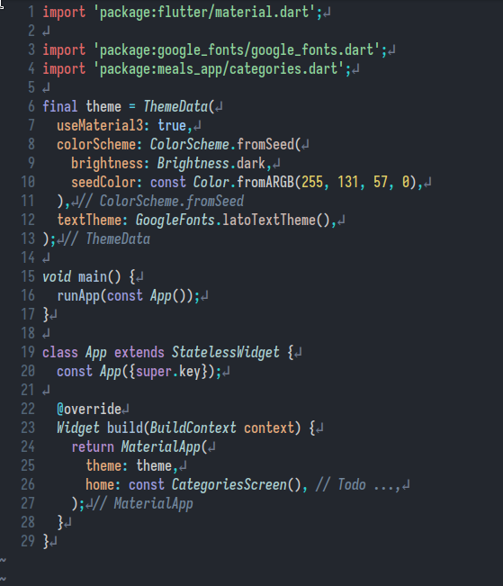

Remember the main code is the main function which executes `runApp` which gets passed a widget
which we extended using Stateful or Stateless widget.

```dart
void main() {
  runApp(App())
}
```

App is going to be a widget that extends Stateful or Stateless widget from material

```
class App extends StatelessWidgets {
}
```

Type `build` in the body and let the LSP insert the completion, and the completion for
constructor too.

The `build` method, as usual, returns `MaterialApp` widget. The `MaterialApp` constructor takes
two arguments relevant for the apps we make:

1. `home`
2. `theme`

The `home`, we set to some widget that extends Scaffold. Because we use the scaffold, we can set the appBar with
an appropriate title and a body, because the Scaffold comes with 2 arguments, `appBar` and `body`.
