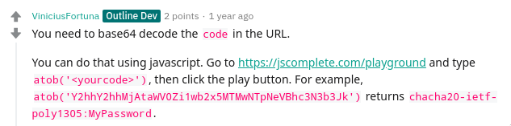

# Getting shadowsocks client setup
The final command that worked for me is:

```
ss-local -s serverip -p port -b localhost -l 1080 -k password -m
beforepasswordsemi -u
```

Here is what I needed to accomplish this:

1. install `ss-local` command, which on archlinux was accomplished as:
```
sudo pacman -S shadowsocks-libev
```
2. now I opened up my gmail account and got the shadowsocks password from the
   invite key. Here, this screenshot from reddit was a massive help:

url: https://jscomplete.com/playground
3. following the instruction there, you would get what should go for -k and -m
4. -k would be the part after semicolon, and -m would be the part preceding it

Now, you have ss-local listening on port 1080

In the *SwitchyOmega* chrome extension I used, I had to use localhost and not
127.0.0.1
