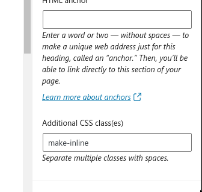
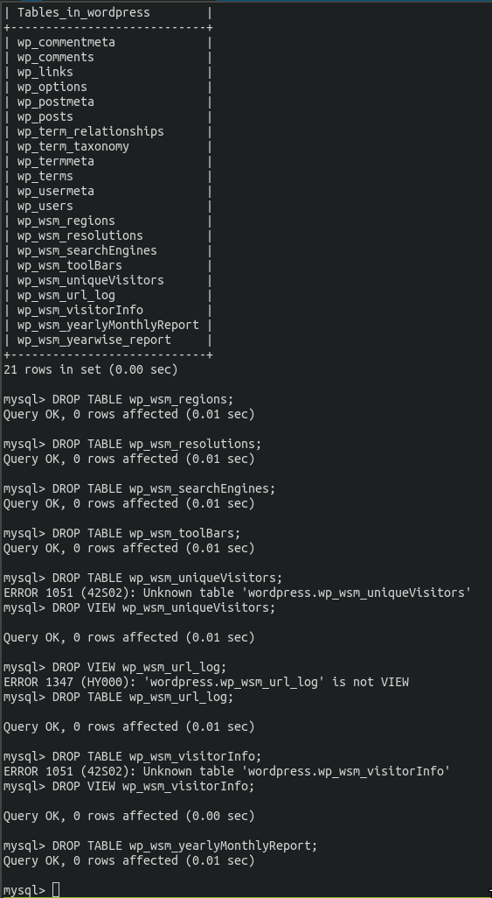
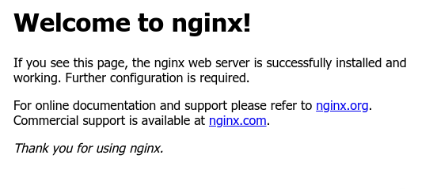

# PHP FPM Upload Correction
```
vim /etc/php/7.4/fpm/php.ini
upload_max_filesize = 1G
post_max_size = 1G
```

There is per site configuration for the pool, and that is:

```
/etc/php/7.4/fpm/pool.d/civilvspace.conf
php_admin_value = 2500M
```

This was what was needed for me..

And btw, if you want to troubleshoot with php, create a `test.php` in the
wordpress directory which contains:

```
<?php
phpinfo();
```

Exactly this btw, there's no change!


# PHP FPM for a new site
```
cd /etc/php/7.4/fpm/pool.d
vim blogvspace.conf

listen = /var/run/php/typevspace.sock
listen.owner = typevspace
listen.group = www-data
listen.mode = 0660
user = typevspace
group = www-data
pm = dynamic
pm.max_children = 75
pm.start_servers = 8
pm.min_spare_servers = 5
pm.max_spare_servers = 20
pm.max_requests = 500

php_admin_value = 25M
php_admin_value = /home/typevspace/logs/phpfpm_error.log
php_admin_value = /home/typevspace:/tmp

systemctl restart nginx
systemctl restart php7.4
```

# Getting About Me Page to look good
1. Added the css below to "Additional CSS Settings"
2. Selected the paragraph right next to image I wanted to align with and did: 
3. Additional CSS classes for this particular paragraph. Additional CSS classes
   for this particular paragraphh

# Wordpress Additional CSS Settings
```
.wp-block-media-text .wp-block-media-text__content {
     direction: ltr;
    -ms-grid-column: 2;
    grid-column: 2;
    -ms-grid-row: 1;
    grid-row: 1;
    padding: 0 8%;
    padding-top: 0px;
    padding-right: 8%;
    padding-bottom: 0px;
    padding-left: 0px;
    word-break: break-word;
}

.make-inline {
15
  display: inline;
16
}
```

# Need to troubleshoot or optmize mysql
Incidentally, this stackexchange question solved my problem:
https://stackoverflow.com/questions/45516971/why-is-mysql-consuming-so-much-memory

```

performance_schema = 0
```

```
vim /etc/mysql/my.cnf
systemctl restart mysql.service
```


# /etc/php/7.4/fpm/pool.d .conf file
I create a file like this for all websites. Example here, I replaced 'techvspace'
with 'civilvspace'

```

listen = /var/run/php/techvspace.sock
listen.owner = techvspace
listen.group = www-data
listen.mode = 0660
user = tutorialinux
group = www-data
pm = dynamic
pm.max_children = 75
pm.start_servers = 8
pm.min_spare_servers = 5
pm.max_spare_servers = 20
pm.max_requests = 500

php_admin_value = 25M
php_admin_value = /home/techvspace/logs/phpfpm_error.log
php_admin_value = /home/techvspace:/tmp
```

# Changing to PHP FPM
From Groovemonkey:
```
sudo apt install php-mysql php-fpm
```

# Apache config a small trial
With this setup, www.vectorspace.xyz was captured by this server but
vectorspace.xyz itself was not.

```
<VirtualHost *:80>
        * The ServerName directive sets the request scheme, hostname and port that
        * the server uses to identify itself. This is used when creating
        * redirection URLs. In the context of virtual hosts, the ServerName
        * specifies what hostname must appear in the request's Host: header to
        * match this virtual host. For the default virtual host (this file) this
        * value is not decisive as it is used as a last resort host regardless.
        * However, you must set it for any further virtual host explicitly.
        ServerName www.vectorspace.xyz

        ServerAdmin webmaster@localhost
        DocumentRoot /var/www/html

        * Available loglevels: trace8, ..., trace1, debug, info, notice, warn,
        * error, crit, alert, emerg.
        * It is also possible to configure the loglevel for particular
        * modules, e.g.
        #LogLevel info ssl:warn

        ErrorLog ${APACHE_LOG_DIR}/error.log
        CustomLog ${APACHE_LOG_DIR}/access.log combined

        * For most configuration files from conf-available/, which are
        * enabled or disabled at a global level, it is possible to
        * include a line for only one particular virtual host. For example the
        * following line enables the CGI configuration for this host only
        * after it has been globally disabled with "a2disconf".
        #Include conf-available/serve-cgi-bin.conf
</VirtualHost>

* vim: syntax=apache ts=4 sw=4 sts=4 sr noet
```

# Update wp-config.php and theme's functions.php
link: https://wordpress.org/support/article/changing-the-site-url
In functions.php:

These 2 entries are added right after the opening <?php
```
<?php
update_option( 'siteurl', 'http://example.com' );
update_option( 'home', 'http://example.com' );
```

In wp-config.php:

```
define( 'WP_HOME', 'http://example.com' );
define( 'WP_SITEURL', 'http://example.com' );
```

# Hardened WordPress Truth
https://stackoverflow.com/questions/53415449/wordpress-hardened-permissions-with-automatic-updates

# Updating Wordpress
1. Download the latest wordpress tar or zip
2. Untarring creates a wordpress folder, so just untar it in the relevant
   directory like
3. After extracting, you should first recursively apply permissions like:
```
cd /home/blogvspace/wordpress
chown -R blogvspace:www-data .
find . -type d -exec chmod 755 {} \;
find . -type f -exec chmod 644 {} \;
chmod 640 wp-config.php
```

This configuration is done only once, later on we have to relax the permission.
The example scheme suggested at wordpress is:

# /wp-admin/
The WordPress administration area: all files should be writable only by your
user account.

# /wp-includes/
The bulk of WordPress application logic: all files should be writable only by
your user account.

# /wp-content/

User-supplied content: intended to be writable by your user account and the web
server process.

Within /wp-content/ you will find:

/wp-content/themes/

Theme files. If you want to use the built-in theme editor, all files need to be
writable by the web server process. If you do not want to use the built-in theme
editor, all files can be writable only by your user account.

/wp-content/plugins/

Plugin files: all files should be writable only by your user account.

# Wordpress Permissions
The most important link here is: https://wordpress.org/support/article/changing-file-permissions/

I think the groovemonkey way is the best. We will go for a more restrictive
nginx config for better security later.

```
cd /home/tutorialinux/public_html
chown -R tutorialinux:www-data .
find . -type d -exec chmod 755 {} \;
find . -type f -exec chmod 644 {} \;
chmod 640 /home/tutorialinux/public_html/wp-config.php
```

# Changing username and his home dir
```
sudo usermod -l blogvspace vector
sudo usermod -d /home/blogvspace -m blogvspace
```

# MySQL Crashcourse
Looking through the "wordpress" database:

```
mysql -u root --database wordpress
SHOW TABLES;
DROP TABLE wp_wsm_countries;
DROP VIEW wp_wsm_dateWiseBounce;
```

This is why you should maintain proper database backups:



Create backups before you install a plugin!

So, I need to modify my program such that it doesn't just name backups according
to date, but gives me the option, if I want it, to name it something that shows
it purpose.

# Listing All databases
```
mysql
SHOW DATABASES;
```

# Delete Database
```
mysql

```

# Listing All Users
```
mysql
SELECT user FROM mysql.user:
```

# Delete User
```
DROP USER bvector;
```

# Creating a new database and a new user
```
mysqldump --add-drop-table --databases wordpress > wordpress-backup.sql.back
mysql
CREATE DATABASE blogvspace DEFAULT CHARACTER SET utf8 COLLATE utf8_unicode_ci;
CREATE USER 'bvector'@'%' IDENTIFIED WITH mysql_native_password BY '@4WsCe23Ha8rLazt';
GRANT ALL ON blogvspace.* TO 'bvector'@'%';
FLUSH PRIVILEGES;
EXIT;
```

# Backing up the database
```
mysqldump --add-drop-table --databases blogvspace > blogvspace-backup.sql.back
```

# Create a copy of an existing database under new name
I got this instruction from https://digitalfortress.tech/sql/duplicate-a-mysql-database-tutorial/

It is as simple as:
```
* -q for quick, and --quote-names to quote names in ``
mysqldump --quote-names -q -u root wordpress | mysql -u root blogvspace
```

# Deleting a databse
mysql -u root -e 'DROP DATABASE `blogvsspace`;' 

# Backing Up
```sh
ssh root@vectorspace.xyz
* First, lets backup the website directory itself.
* tar zcf "where I want the backup to be, and its name" relative-path-to-directory
tar zcf /home/sentinel/backups/$(date '+%d-%m-%y-%H%M')-vectorspacexyz.tar.gz vector
```

Note that when I'm doing the backup, I'm located in the directory that contains
the directory I want to backup. This is so because it seems that tar discourages
absolute paths to the directory being backed up.

`tar zcf backups/vectorspace/"$(date '+%Y-%m-%d').tar.gz" vector`

When decompress with `tar xf` I also see that the permissions are preserved.
Uncompressing also relaces contents in the current directory.

So, I think I actually prefer a `backup` folder in `/home` directory. Where
`/home` contains all files that are specific to the given site. And I can have
nginx serve these directories as different sites: 


1. `blog.vectorspace.xyz`
2. `civil.vectorspace.xyz`
3. `maths.vectorspace.xyz`
3. `code.vectorspace.xyz`
# php and nginx user in debian/ubuntu
www-data

# mmdb lookup
```
mmdblookup --file /etc/maxmind/GeoLite2-ASN.mmdb --ip 68.183.232.23
```

# Access Log
```
goaccess -p /etc/goaccess/goaccess.conf /var/log/nginx/access.log -o /home/vector/report.html
```

# Security Tips
No one gets to see wp-config.php

In `/etc/nginx/sites-enabled/vectorspace.xyz`:
```
location = /wp-config.php { deny all; return 404; }
```

No one needs to see what my webserver and nginx version is:

```
server_tokens off;
```

All files should be owned by your user account, and should be writable by you.
Any file that needs write access from WordPress should be writable by the web
server, if your hosting set up requires it, that may mean those files need to be
group-owned by the user account used by the web server process.

```
chown -R vector:vector wp-admin
chown -R vector:vector wp-includes
chown -R vector:vector wp-plugins
find /home/vector/html -type d -exec chmod 755 {} \;
find /home/vector/html -type f -exec chmod 644 {} \;
chown -R www-data:www-data owa-data
chown www-data:www-data owa-config.php
```

# Installing the Nginx Web Server
```
sudo apt update
sudo apt install nginx
```

If you have `ufw` enabled, as recommended in our initial setup guide, you will
need to allow connections to nginx. Nginx registers a few different UFW profiles
upon installation. To check the UFW profiles run:

```
sudo ufw app list
```

It is recommended that you enabled the most restrictive profile that will still
allow the traffic you need. Since you haven't configured SSL for your server in
this guide, you will only need to allow regular HTTP traffic on port 80.

```
sudo ufw allow 'Nginx HTTP'
```

You can verify this change by running:

```
sudo ufw status
```

*NOTE*: In my case I was running an SSH session, and I tried to enable ufw with
```
sudo ufw enable
```

But this warned me that SSH connection might get distrupted, so I ran:
```
sudo ufw allow OpenSSH
```

Confirmed ssh back in works.

We can now test nginx works accessing the site through our public ip address:



Good! Now we know nginx is up and running!

# Static Blog Exercise With Nginx
Before we try and install WordPress, we need to be clear on what we have to get
SSL working in nginx. This simple configuration to serve our static blog must
come first first.

First we create an normal userpath where we will be placing these files. I will
call this user vector.

```
useradd -m -G sudo -s /bin/bash vector
```

Transfering the files to the server with:

```
scp -r html root@134.209.105.158:/home/vector/
```

Now we head to `/etc/nginx/sites-available` and create `vectorspace.xyz`:

```
server {
  listen 80 default_server;
  listen :80 default_server;

  root /home/vector/html;

  index index.html;

  server_name vectorspace.xyz www.vectorspace.xyz;

  location / {
    try_files $uri $uri/ =404;
  }
}
```

After creating this file, we cd into `/etc/nginx/sites-enabled` and do `rm default`:

```
cd /etc/nginx/sites-enabled
rm default
ln -s /etc/nginx/sites-available/vectorspace.xyz /etc/nginx/sites-enabled/vectorspace.xyz
```

Now run `systemctl restart nginx` to make sure the website works!

# Enabling HTTPs with nginx
In DO, I added `vectorspace.xyz` as an A record and `www.vectorspace.xyz` as an MX record

Install `python-certbot-nginx`

```
apt install python3-certbot-nginx
```

Next we run `certbox --nginx certonly`:

```
certbot --nginx certonly -d myconceptlogs.cyou -d www.myconceptlogs.cyou
```

We note the following message:
```
- Congratulations! Your certificate and chain have been saved at:
  /etc/letsencrypt/live/vectorspace.xyz/fullchain.pem
```

# Tell nginx to use SSL cert for your website
Firstly we add the following section to server block:

```
server {
  * ... previous contents were here
  ssl on;
  ssl_certificate /etc/letsencrypt/live/vectorspace.xyz/fullchain.pem;
  ssl_certificate_key /etc/letsencrypt/live/vectorspace.xyz/privkey.pem;
}
```

This tells nginx to enable SSL and use the specified key and certificate for that server.

We also face an an issue: Port 80, what're currently listening to, is for HTTP
connections. SSL uses port 443. The solution? Change the port from 80 to 443

```
server {
   listen 443 default_server;
   listen :443 default_server;
   #... all other content
}
```

However, this breaks people going to the website without https:// explicitly in
the URL. To fix this, we'll redirect HTTP requests to the HTTPS url. Add the
following new server block after HTTPS (443) server block:

```
server {
       listen 0.0.0.0:80;
       server_name jgefroh.com www.jgefroh.com;
       rewrite ^ https://$host$request_uri? permanent;
}
```

I forgot, we first got to enable 443 port in our firewall:

```
ufw app list
ufw allow 'Nginx HTTPS'
```

Now try it! Finally you have HTTPs enabled. This is how simple things really
are, and you must be aware of this simplicity before proceeding to more
complicated stuff.

# Installing MySQL
Now that you have a webserver up and running, you need to install the database
system to be able to store and manage data for your site. MySQL is a popular
database management system used with PHP Environments

```
apt install mysql-server
```

Keep track of the password for mysql-root user and answer Y for every question
of the startup.

# Installing PHP
You have nginx installed to serve your content and MySQL installed to store and
manage your data. Now you can install PHP to process code and generate dynamic
content of for the webserver. 

While Apache embeds the PHP interpreter in each request, Nginx requires an
extern program to handle PHP processing and act as a bridge between PHP
interperter itself and the web server. THis allows for a better overall
performance in most PHP-based websites, but it requires additional
configuration. You'll need to install `php-fpm`, which stands for"PHP fastCGI
process manager", and tell Nginx to pass PHP requests to this software for
processing. Additionallyl, you'll need `php-mysql`, a PHP module that allows PHP
to communicate with MySQL-based databases. Core PHP packages will automatically
be installed as dependencies.

To install `php-fpm` and `php-mysql`, run:

```
sudo apt install php-fpm php-mysql
```

We add the following to our server block in nginx:

```
 location ~ \.php$ {
   include snippets/fastcgi-php.conf;
   fastcgi_pass unix:/var/run/php/php7.4-fpm.sock;
}
```

# Testing PHP with Nginx
Create the file:

```
vim /home/vector/html/info.php
```

With contents:

```
<?php
phpinfo();
```

Go to your website by ip or domain like:
```
http://vectorspace.xyz/info.php
```

# Testing database connection from php
link: https://www.digitalocean.com/community/tutorials/how-to-install-linux-nginx-mysql-php-lemp-stack-on-ubuntu-20-04

# Create WordPress Database
You can create a new password by:
```
echo -n @ && cat /dev/urandom | env LC_CTYPE=C tr -dc  | head -c 15 && echo
```

```
mysql>
CREATE DATABASE wordpress DEFAULT CHARACTER SET utf8 COLLATE utf8_unicode_ci;
```

```
CREATE USER 'vector'@'%' IDENTIFIED WITH mysql_native_password BY '@263Fv63bOQIlp9S';
```

```
GRANT ALL ON wordpress.* TO 'vector'@'%';
```

```
FLUSH PRIVILEGES;
```

```
EXIT;
```

# Installing Additional PHP Extensions
```
sudo apt update
sudo apt install php-curl php-gd php-mbstring php-xml php-xmlrpc php-soap php-intl php-zip
```

# Minor adjustments to vectorspace.xyz sites-available file
```
    location = /favicon.ico { log_not_found off; access_log off; }
    location = /robots.txt { log_not_found off; access_log off; allow all; }
    location ~* \.(css|gif|ico|jpeg|jpg|js|png)$ {
        expires max;
        log_not_found off;
    }
```

Instead of the existing location / block, we need to adjust the `try_files` list
so that instead of returning a 404 error as the default option, control is
passed to the `index.php` file with the request arguments.

```
server {
    . . .
    location / {
        #try_files $uri $uri/ =404;
        try_files $uri $uri/ /index.php$is_args$args;
    }
    . . .
}
```

# Downloading WordPress
```
curl -LO https://wordpress.org/latest.tar.gz
```

In my case I did:
```
cd /home/vector
curl -LO https://wordpress.org/latest.tar.gz
tar xzf latest.tar.gz
mv wordpress html
chown -R vector:vector html
cp html/wp-config-sample.php wg-config.php
```

# Setting up the WordPress configuration file
 
```
curl -s https://api.wordpress.org/secret-key/1.1/salt/
```
